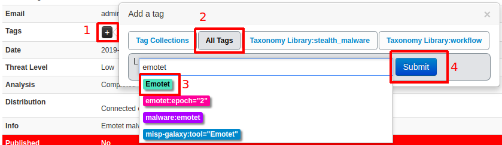

THIS FILE NEEDS TO BE REMOVED FROM THE FINAL VERSION
Most recent version is on Google Docs:
https://docs.google.com/document/d/1PSjuQqUHJNkpsewnNx4xO2hm8P_evbahxi832hg0AQ8/

# MISP admin configuration exercise

## Introduction
This exercise is designed for the analysts willing to expand their knowledge about MISP use cases and overall usage.

## Preconfigured states
For the exercise purposes, we prepared two states of the exercise that you can install by instructions provided in the next section.

### misp-bare
This state consists of two MISP systems. One (https://misp.enisa.ex) is not configured at all.
This represents state after admin configuration.
- There are taxonomies and galaxies downloaded.
- There are multiple events imported from open source of events.
- One account is available with username: `admin@admin.test` and password `FirstInstancePassword!`.

Another instance (https://misp2.enisa.ex) contains data and minimal configuration.
Credentials: `admin@admin.test:SecondInstancePassword123!`

For easier use of both instances, you can run two browsers, at least one in incognito mode, then login to both MISPs at the same time.

### misp-configured
This represents both misps in condition after the exercise is finished.
Follow the steps below to get to this stage from the misp-bare snapshot.

## Exercise
### Installation
To enable the exercise that contains two misp instances, type in the `/opt/enisa/trainings-2019/analyst/misp` folder following commands `./reset_data.sh` and then `helm install --atomic misp-bare`.
The enviroment is ready when the prompt returns, it can take a while for the exercise to start depending on your's virtual machine processing power.
File `README.md` contains README that you are reading right now. `reset-data.sh` script resets any progress you made during the exercise 
**NOTE: To use the script, stop the exercise by issuing command `helm delete <id>` where id is chart id which can be obtained with `helm ls`**.

Log into your organization's MISP with web browser (https://misp.enisa.ex). This instance is only accessible from the provided VM.

We will start by explaining what events are and what you can do with them.

### Events
Events are the core of misp instance. They allow you to manage, share and enrich intelligence of yours and other organisations.

Quick overview of the events view is presented in the image taken from MISP book (https://www.circl.lu/doc/misp/).

Detailed description of adding an event is described below.

#### Adding events
First of all, we need to create a **new event**. 
To do so, we click the `Add Event` option when on the `List Events` view.
1. `Event Actions` -> `Add Event`
  - `Distribution`: Defines how far in the chain of synchronized misps the event is gonna be published.
    In practice this can be defined as number of hops that the event is gonna make before not being distributed further.
    - **This organistation only** (0 hops) - only organisation defined in `MISP.host_org_id` can access the event.
    - **This community only** (1 hop) - every organisation inside current misp instance gets the event.
    - **Connected communities** (2 hops) - every organisation that is integrated with one of our synchronized organisations.
    - **All communities** (infinite hops) - any organisation in the chain of connected organisations.
  - `Analysis`: Defines if the event is in ongoing analysis or it's analysis has already completed.
  - `Threat Level`: Defines level of importance of the event.
    - **Undefined** - No risk
    - **Low** - Mass-malware
    - **Medium** - APT malware
    - **High** - Sophisticated APT malware or 0-day attack
    
  - `Event info`: Description of the event, conscise info of what happened, what the event is about.
  - `Extends event`: MISP allows for correlation of events, in this field you can put UUIDs of other events that correlate to this incident.

After creating an event we are redirected to the details view. Here we can add **tags**, **attributes**, **related events**, **correlations** and so on.

Attributes are very important part of an event, they contain informations such as _IoCs_, _C&C addresses_, _md5 hashes_, or other additional information. There are multiple types of attributes.

##### Exercise
###### Ex.1 - Adding an event
Imagine that you have observed a new malware sample inside your organisation. 
It wasn't able to infect any of the hosts inside your org, but you collected the sample and started the analysis.

Information about the sample can be found in the REPORT.pdf.

Try to add an event describing all of the information contained in the report.

Make use of the correct tags, taxonomies and attributes.

If you are stuck, below are the exact instructions of how it could be done:
- Go to `Event Actions` -> `Add Event`, fill the fields appropriately.
  `Date`, `Event info` and `Analysis` fields are pretty obvious.
  We set threat level and distribution according to the descriptions presented in the previous chapter.
  

- For easier grouping and correlation, we should add a tag describing the malware family, we can just put `emotet` inside the `Add a tag` form. There are multiple options to choose from, ideally we should add all of them that describe it as emotet. Another important tag to set is `tlp` tag, it describes sharing permissions of the intel according to the [Traffic Light Protocol](https://www.us-cert.gov/tlp).

If you choose the `misp-galaxy:tool="Emotet"` and click submit you can observe no tag was added. What actually happened is that you added the event to the emotet galaxy. You can observe that lower on the site.

More detail about galaxies can be found in the next sections.
- Last of the important things to do is to add some attributes describing the event. Attributes section is located at the bottom of the site.

To add new attribute, you should click the `+` sign in the top left corner.
You will be presented with the following form

For example, to add `sha256` of the sample you should fill the fields of the form in the similar way to presented below

**Try adding the rest of the attributes on your own.** - This should result in the attributes section looking like this (your result may vary):

As you can see, attributes have tags and galaxies sections as well, this allows for better granularity in describing the event and payloads associated with it. Click around, see if there are any tags or galaxies useful for attributes you just added.

When you make appropriate changes to the event and you consider it finished you can share it with other organisations by clicking on `Publish event` on the left panel.

Now let's see how the event presents itself on the events list.
- `Event Actions` -> `List Events`

###### Ex. 2 - Search and correlation
In this exercise we will focus on search and filtering abilties of MISP. Experience with working with events obtained in previous exercise will come in handy.
 
Try to find all unclassified events in MISP that may be correlated in any way with the event you added in the previous exercise. 
There are multiple ways to correlate in MISP. Through search, Correlation Graph, `Related Events` view or in the `Attributes` view. 

What related events were you able to find?

If you are stuck, below are some tips of how it could be done:
- Search can be found in the Event List view, accessible by `Event Actions` -> `List Events`. **NOTE: All events on the list are actually from different organistation than ours. Our organisation is called `MY-SUPER-CERT` and the feed inside the MISP is from organisation `ORGNAME`. **
Here you can enter any value from the attribute and all the associated events should be presented. Try `6de788187b9a790f0a378b94f02582e1453d4f77f5ac4c742c7ffc4bef0ea157` or `104.199.245.51`.
Have in mind that this can sometimes take a little bit longer (for large datasets). See what other related events you can find with this method.

- `View Correlation Graph` can be found in event view on the left side.
In this case, we can easily see an event that shares two attributes with the one we created.
You can expand nodes by selecting them and pressing `Ctrl+x`. This is a powerful tool that enables you to investigate whole clusters of malware. Try to click around and see what else you can find.

- `Related Events` can be found in event view on the right side on the top.
Here without performing any actions you can see potentially related events based on attributes.

By searching and correlating you can clearly see how powerful and important attributes entered into MISP instance are.

### Galaxies
You already have a galaxy before, below you can find description on how they work.

In MISP, galaxies are used to express a **large object** called cluster. They are formed by elements _(key:value pairs)_. Default vocabularies are available in MISP galaxy – they can be overwritten, replaced or updated.

To add galaxy to the event go to the detailed event view of the event you created in the previous chapter. Then scroll down to `Galaxies` and click on `Add`. 
Choose `All namespaces`, in `Select an Option` choose appropriate malware type and family, then click `Submit`.

##### Examples of galaxies
- Ransomware – galaxy based on https://goo.gl/6e3wia
- Threat actor – characteristics of malicious actors or adversaries.
- Exploit-kit – list of some exploit kits used by threat actors. The list includes document, browser and router exploit kits. It's not meant to be exhaustive but aim at covering the most seen threats from category in the past 5 years.

### Taxonomies
You already used a taxonomy before - `tlp`, below you can find description on how they work.

Taxonomy is a group of „**machine tags**” used to tag events and attributes. Every tag is composed of a namespace (mandatory), a predicate (mandatory) and a value (optional). Example: osint:source-type=”blog-post” (osint - namespace, source-type - predicate, “blog-post” - value).

These machine tags are often called **triple tag** due to their format. In MISP there are several taxonomies ready to use, but users can also create their own ones.

As with galaxies, we can **try them** out in our event we created earlier.
Find your event in `List Events` view once again.

Look at the `List Events` view to see your event having more information available.

##### Popular taxonomies
- TLP (Traffic Light Protocol) – classification of sensitive information distribution. There are 4 TLP levels: **TLP: RED** (personal for named recipients only), **TLP: AMBER** (limited distribution), **TLP: GREEN** (distributed for particular community) and **TLP: WHITE** (for unlimited distribution).
- osint – Open Source Intelligence - Classification (MISP taxonomies) 
- malware_classification  – Classification based on different categories. Based on https://www.sans.org/reading-room/whitepapers/incident/malware-101-viruses-32848 
